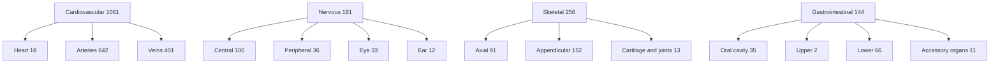

# Human Atlas: System Remap, Sub-Systems, and Quiz Fairness

## Context

Explored [app/anatomy.ts](app/anatomy.ts), [app/game-questions.ts](app/game-questions.ts), [app/page.tsx](app/page.tsx), and analyzed all 2,234 parts in `public/models/atlas.json`.

Source of truth for the taxonomy: [Cleveland Clinic — The Human Body](https://my.clevelandclinic.org/health/body/human-body-anatomy), which lists **12** organ systems.

### Data problems found

The current 15-"system" taxonomy mixes organs, tissue types, and vessel types with actual systems, and contains four genuine misfilings:

| Current | Parts | Problem |
|---|---|---|
| `cardiac` "**Heart**" | 23 | An **organ**, not a system. Also contains **5 brain ventricles** (third, fourth, lateral, interventricular foramen) mixed in with mitral valve leaflets. This is the real cause of the "brain is under cardiac" bug flagged in the earlier TARS audit and previously written off as unfixable. |
| `arterial` / `venous` | 639 / 404 | Vessel *types*, not systems. Both are Cardiovascular. |
| `sensory` | 45 | Not a CC system. |
| `connective` | 40 | Not a CC system. |
| `skeletal` | 296 | Contains **30 teeth and gingiva** (teeth are not bones) and **~10 laryngeal/nasal cartilages** that form the airway. |
| `integumentary` "Body surface" | 5 | Right system, misleading label. |

### Key insight on sub-systems

Sub-systems recover the two capabilities that a strict CC remap would otherwise destroy: **artery-vs-vein isolation** and **eye/ear isolation**. Both were real losses I flagged; sub-systems eliminate them as tradeoffs.



## Implementation steps

### 1. Remap script

**New `scripts/remap-systems.mjs`** — rewrites `public/models/atlas.json` in place, backing up to `atlas.pre-remap.json`. Idempotent. Prints a before/after table and emits `unmapped-parts.md`.

New `SystemId` union:
```
'cardiovascular' | 'endocrine' | 'exocrine' | 'gastrointestinal' |
'integumentary'  | 'lymphatic' | 'muscular' | 'nervous' |
'reproductive'   | 'respiratory' | 'skeletal' | 'urinary'
```

Mapping rules (all validated by dry run):

| From | Rule | To |
|---|---|---|
| `arterial`, `venous` | all (incl. `arch`, `arteria`, `digital arteries` — the 29 that a naive `artery` match misses) | cardiovascular |
| `cardiac` | third/fourth/lateral ventricle, interventricular foramen | **nervous** |
| `cardiac` | valves, cusps, leaflets, atrium/ventricle cavities and walls | cardiovascular |
| `sensory` | lacrimal, nasolacrimal | **exocrine** (CC: "mucus or tears") |
| `sensory` | rectus, oblique, levator, tendinous ring | muscular |
| `sensory` | remaining eye/ear | **nervous** |
| `connective` | tendon, trochlea | muscular |
| `connective` | ligament, membrane, cartilage, meniscus, disc | skeletal |
| `connective` | fascia, linea alba, raphe, tendinous arch, conus elasticus | muscular *(fallback, reported)* |
| `digestive` | submandibular, sublingual glands | **exocrine** |
| `skeletal` | tooth, molar, incisor, canine, premolar, gingiva | **gastrointestinal** |
| `skeletal` | cricoid, thyroid, arytenoid, corniculate, alar cartilage | **respiratory** |
| `digestive` | all remaining | gastrointestinal |

`unmapped-parts.md` lists every part that hit a fallback rather than an explicit rule, with old system, new system, and name, so nothing is silently reassigned.

### 2. Sub-systems

Add `subsystem?: SubsystemId` to `Part` and a `SUBSYSTEMS` registry in [app/anatomy.ts](app/anatomy.ts) keyed by parent system. Optional field, so any part without one simply renders under its parent.

Assignment rules:
- **Cardiovascular** — Heart (valves/cavities/walls) / Arteries / Veins
- **Nervous** — Peripheral if nerve, plexus, ganglion, ramus; Eye if eye-specific; Ear if ear-specific; else Central. Inverting the test this way absorbs the 44 deep brain structures (amygdala, hippocampus, putamen, insula, colliculus, optic chiasm) that a keyword list misses.
- **Skeletal** — Axial / Appendicular / Cartilage and joints, with `atlas`, `axis`, `manubrium`, `xiphoid`, `trapezoid`, `triquetral`, `sesamoid` added so the 35-part remainder classifies.
- **Gastrointestinal** — Oral cavity / Upper / Lower / Accessory organs

### 3. Systems panel UI

The panel becomes a two-level accordion: 12 parent rows always visible, sub-rows revealed by a chevron.

There is a real tension with the no-scrollbar fix from last session, which was validated for 15 rows. 12 parents plus the largest sub-group (4) is 16 rows, so **only one parent expands at a time** (accordion) and expanding is an explicit user action. All 12 top-level systems remain visible without scrolling at every viewport height, which is the requirement that actually matters.

Parent toggle drives all children; a partially-enabled parent renders an indeterminate state.

### 4. Remove difficulty multipliers

- Delete `DIFFICULTY_MULTIPLIER`; `scoreQuestion` becomes `base + timeBonus − penalty`. Difficulty still differentiates via timer (60/45/30/20/10s) and hint budget.
- Strip the `{n}x` badge from difficulty buttons and the results screen.
- **Server-side:** the Snowflake table is **empty**, so there is nothing to rewrite. I will still run an idempotent guarded `UPDATE` in case rows land before deploy.
- **Legacy local scores** in browser `localStorage` do carry multiplied values. [app/game-store.ts](app/game-store.ts) will divide them by the old multiplier during its one-time migration, so an inflated 5x Medical School score cannot permanently top the shared board.

### 5. Quiz question-type fairness

Root cause: `generateQuiz` hardcodes one mix for every level —
`shuffle(['find','find','multiple-choice','multiple-choice','system-id'])` — so College and Medical School always get a `system-id` ("tap any structure in the X system") question.

- Add `DIFFICULTY_TYPES`: elementary 2/1/2, middle 2/2/1, high 3/2/**0**, college 3/2/**0**, medical 3/2/**0** (find / MC / system-id).
- Add `answerLeaksFromName(conceptName, systemName)` to kill giveaway trivia such as "Which system does the *left renal artery* belong to?" — token overlap plus a synonym table (artery, vein, aorta to cardiovascular; nerve to nervous; bone, vertebra to skeletal; muscle to muscular; gland to endocrine/exocrine). On a leak, fall back to the explanation-based variant; for college and medical, drop that MC variant entirely.

### 6. Quiz system variety

Root cause: `matched.slice(0, 5)` takes five shuffled concepts with no diversity constraint. Cardiovascular will hold ~1,061 of 2,234 parts, so consolidating arteries and veins makes the 4-of-5-arteries problem **worse** unless fixed in the same change.

- Add `pickDiverse(concepts, atlas, n)`: greedy selection rejecting a concept whose system is already used, relaxing only if the pool cannot fill five, and **never** placing two same-system questions back to back.
- Prefer **sub-system** diversity within Cardiovascular, so a round can hold one artery and one vein question without feeling repetitive.
- Exclude the previous round's concepts (component state) so an immediate replay differs.

## Verification

- `npx tsc --noEmit` and `npm run build`.
- **Remap assertions** — every part carries one of the 12 valid ids; no retired id (`cardiac`, `arterial`, `venous`, `sensory`, `connective`, `digestive`) survives anywhere in `app/`; part count is still exactly **2,234**; every declared system and sub-system has at least one member.
- **Quiz simulation** — 200 rounds per difficulty asserting zero `system-id` at high/college/medical, zero back-to-back same-system questions, zero leaky MC questions; print the system distribution to confirm Cardiovascular no longer dominates.
- **Panel check** — browser-verify all 12 parents visible with no scrollbar at 900px, 800px, and 750px viewport heights, and that expanding one parent still fits.
- **Deploy** — versioned image tag plus `ALTER SERVICE ... FROM SPECIFICATION` (suspend/resume does **not** re-pull `:latest`, established last session), then confirm the endpoint URL is unchanged and the leaderboard API still starts.
- Commit and push.

## Critical Files

- [app/anatomy.ts](app/anatomy.ts) - `SystemId` union, `SYSTEMS`, new `SUBSYSTEMS` registry, `DEFAULT_VISIBLE`
- [app/game-questions.ts](app/game-questions.ts) - `DIFFICULTY_TYPES`, `pickDiverse`, `answerLeaksFromName`, multiplier removal
- [app/page.tsx](app/page.tsx) - two-level accordion systems panel, visibility state per sub-system
- `scripts/remap-systems.mjs` - the data migration and `unmapped-parts.md` report
- [app/game-store.ts](app/game-store.ts) - legacy multiplied-score normalization

## Risks

- **Remap is a data migration.** Guarded by the `atlas.pre-remap.json` backup, an idempotent script, and a hard part-count assertion.
- **Panel row budget.** 12 parents plus one expanded group is 16 rows against a 15-row validated budget, hence the one-at-a-time accordion. Needs the browser re-check at 750px.
- **[app/agent-tools.ts](app/agent-tools.ts)** likely exposes system ids to the agent surface and needs the same rename treatment.
- **Sub-system rules are name-based** and so will drift if the atlas is ever regenerated from a newer BodyParts3D release. The `unmapped-parts.md` report is the early-warning signal.
